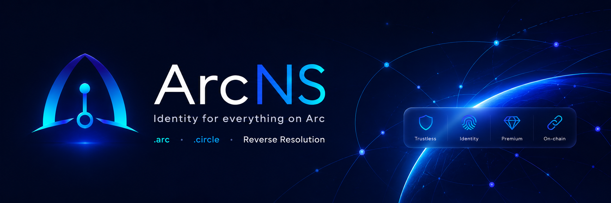

<p align="center">
  
</p>

# ArcNS — Arc Name Service

**Independent decentralized naming protocol · Built on Arc.**

<p>
  <a href="https://github.com/khenzarr/arcns/actions/workflows/frontend-ci.yml"></a>
  <a href="#license"></a>
  <a href="https://arcname.services/app"></a>
  <a href="https://github.com/khenzarr/arcns/stargazers"></a>
</p>

[Live app](https://arcname.services/app) · [Try demo](https://arcname.services/#experience) · [Integration guide](https://arcname.services/developers/integrate) · [Documentation](#documentation)

ArcNS maps human-readable names ending in `.arc` and `.circle` to on-chain addresses, issues names as ERC-721 NFTs for selected registration periods, and lets any address set a verified primary name.

ArcNS is an independent naming protocol built on Arc. It is not operated by, affiliated with, sponsored by, or endorsed by Circle or the Arc team. Arc is a trademark of Circle Internet Group, Inc. and/or its affiliates.

> Neither the ArcNS name nor the `.arc` or `.circle` namespaces imply official Arc or Circle ownership, affiliation, sponsorship, or endorsement.

Names are registered with USDC, owned as NFTs, and resolved entirely on-chain. No off-chain infrastructure is required to read or verify a name.

---

## What ArcNS Enables

- **Human-readable identity** — register `alice.arc` or `bob.circle` and point it to any EVM address
- **USDC-native registration** — pay registration fees with USDC on Arc
- **On-chain resolution** — forward resolution (`name → address`) and reverse resolution (`address → primary name`) are both fully on-chain
- **NFT ownership** — every registered name is an ERC-721 token with on-chain SVG metadata
- **Primary name** — any address can set a verified primary name; the protocol enforces forward-confirmation so stale records are detectable
- **Portfolio and history** — subgraph-backed domain portfolio, registration history, and renewal tracking
- **Annual renewal model** — names are registered for a chosen duration with a 90-day grace period on expiry

---

## Current Status

**Live on Arc Mainnet**

| Component | Status |
|-----------|--------|
| Protocol contracts | Deployed on Arc Mainnet (2026-09-16) |
| Administration | Safe custody and Timelock role handoff completed |
| Indexed data layer | Mainnet Goldsky primary and The Graph Studio fallback deployed and checked |
| Source verification | 12/12 exact-match on the official Arc explorer |
| Frontend and resolver API | Live on Arc Mainnet (`5042`) at arcname.services |
| Early-adopter campaign | Active; snapshot-eligible wallets receive a one-time first-registration price |

The references below describe the deployed, source-verified protocol and the production mainnet application. The early-adopter root is frozen and the campaign is active on mainnet.

**Website and app:** [arcname.services](https://arcname.services)

---

## Core Capabilities

### Registration
Commit-reveal scheme prevents front-running. Users commit a hash, wait 60 seconds, then register. USDC is transferred to the treasury on success. The name NFT is minted to the registrant.

### Renewal
Any address can renew any name by paying the USDC renewal cost. The expiry is extended by the requested duration. A 90-day grace period follows expiry before the name becomes available for re-registration.

### Resolver (v1 scope)
The v1 Resolver stores EVM address records (`addr`) for each name node. The Resolver is a UUPS proxy — future versions will add text records, contenthash, and multi-coin addresses without redeployment.

### Reverse / Primary Name
Any address can set a primary name via the ReverseRegistrar. The protocol stores the reverse record on-chain. Consumers must forward-confirm the reverse record before trusting it — the `addr` record of the claimed name must resolve back to the queried address.

### NFT Ownership
Names are ERC-721 tokens on the BaseRegistrar contracts. Token ID is `uint256(keccak256(label))`. `tokenURI` returns fully on-chain JSON metadata with an inline SVG image — no external fetch required.

### Indexed Data Layer
The mainnet indexed data layer uses Goldsky as its primary provider and a separately deployed The Graph Studio endpoint as fallback. Both endpoints have passed schema and indexed-block checks. Studio hosting is not a decentralized publication or a production availability guarantee.

The indexed data layer powers registrations/renewals history, transfers, resolver record changes, reverse record changes, and portfolio views in the frontend.

---

## Architecture

```
┌─────────────────────────────────────────────────────────────────┐
│                        ArcNS Protocol                           │
├─────────────────────────────────────────────────────────────────┤
│                                                                 │
│   ArcNSRegistry (non-upgradeable)                               │
│   Central node → (owner, resolver, TTL) map                     │
│         ↑                                                       │
│   ┌─────┴──────────────────────────────────┐                   │
│   │ ArcNSBaseRegistrar (.arc)  ERC-721      │                   │
│   │ ArcNSBaseRegistrar (.circle) ERC-721    │                   │
│   └─────┬──────────────────────────────────┘                   │
│         │                                                       │
│   ┌─────▼──────────────────────────────────┐                   │
│   │ ArcNSController (.arc)   UUPS proxy     │                   │
│   │ ArcNSController (.circle) UUPS proxy    │                   │
│   │ commit/reveal · USDC payment · renew    │                   │
│   └─────┬──────────────────────────────────┘                   │
│         │                                                       │
│   ┌─────▼──────────────────────────────────┐                   │
│   │ ArcNSPriceOracle (non-upgradeable)      │                   │
│   │ USDC pricing by label length            │                   │
│   └────────────────────────────────────────┘                   │
│                                                                 │
│   ┌────────────────────────────────────────┐                   │
│   │ ArcNSResolver  UUPS proxy              │                   │
│   │ addr records (v1) · name records       │                   │
│   └────────────────────────────────────────┘                   │
│                                                                 │
│   ┌────────────────────────────────────────┐                   │
│   │ ArcNSReverseRegistrar (non-upgradeable) │                   │
│   │ addr.reverse → primary name mapping    │                   │
│   └────────────────────────────────────────┘                   │
│                                                                 │
└─────────────────────────────────────────────────────────────────┘

Payment flow:
  User → approve(USDC, controller, amount)
       → controller.commit(hash)
       → [wait 60s]
       → controller.register(...)
       → USDC transferred to treasury
       → ERC-721 minted to registrant
       → Registry node assigned
```

**Contract upgradeability:**
- Registry, BaseRegistrars, PriceOracle, ReverseRegistrar — non-upgradeable (ownership ledger stability)
- Controller, Resolver — UUPS proxies (registration logic and resolver feature set may expand)

---

## Live Deployment

**Network:** Arc Mainnet · **Chain ID:** 5042 · **Deployed:** 2026-09-16

| Contract | Address |
|----------|---------|
| ArcNSRegistry | `0xcA4d60A6d237EDa59aA1F57EbAe6B3150BcAb8Fb` |
| ArcNSResolver (proxy) | `0x68Bb5D43E8c7394876de2174d1BA320745D47023` |
| ArcNSReverseRegistrar | `0x3731b7c9F1830aD2880020DfcB0A4714E7fc252a` |
| ArcBaseRegistrarV2 (.arc) | `0x1a99540B48A21db03c768760052c3F915F9852aB` |
| CircleBaseRegistrarV2 (.circle) | `0xC3568DF382599495ed7f10188a417858E00eb720` |
| ArcController (.arc proxy) | `0xE62De42eAcb270D2f2465c017C30bbf24F3f9350` |
| CircleController (.circle proxy) | `0x5A1275Ed5638C9aD5005d6087c696BFb3848e9E1` |
| ArcNSPriceOracle | `0x61baCC1623Eb5C1Ccd5D46B05CF6EB8Dd8130cc8` |
| DiscountRegistry | `0xEec7ac0d3C3bE402b6F2b492c7479B2897e64BA2` |
| Timelock | `0x609B9dAb0AC21c0863A5297f86BDd4C500647e3c` |
| Admin Safe | `0xFd48189D3Feb99a5cC6fcC6896744DAa73F3BF72` |
| Treasury | `0x0b943Fe9f1f8135e0751BA8B43dc0cD688ad209D` |
| USDC | `0x3600000000000000000000000000000000000000` |

**Primary indexed endpoint (Goldsky):** `https://api.goldsky.com/api/public/project_cmpn4idciwist01th4uejh86p/subgraphs/arcns-mainnet/1.0.1/gn`
**Fallback indexed endpoint (The Graph Studio):** `https://api.studio.thegraph.com/query/1748590/arc-ns-mainnet/1.0.1`
**RPC:** `https://rpc.mainnet.arc.io`
**Canonical mainnet addresses:** [deployment record](deployments/arc_mainnet-v3.json)

All active ArcNS contracts are exact-match source-verified on the official Arc Explorer. Historical deployment records remain available for reproducibility.

---

## Pricing (USDC / year)

| Label length | Annual price |
|-------------|-------------|
| 5+ characters | $5.00 |
| 4 characters | $15.00 |
| 3 characters | $25.00 |
| 2 characters | $50.00 |
| 1 character | $100.00 |

Pricing is computed by the PriceOracle in USDC with 6 decimal places. Duration is pro-rated. A 5% slippage guard is applied at registration time.

Verified snapshot-eligible wallets may use their active one-time first-registration benefit: $2 / $10 / $15 / $25 / $50 for 5+ / 4 / 3 / 2 / 1 characters respectively. The benefit applies to one registration across `.arc` and `.circle`; multi-year registrations discount only the first year, and renewals use standard pricing. The final on-chain quote determines the amount payable.

---

## Repo Structure

```
arcns/
├── contracts/v3/              ← Active canonical contracts
│   ├── controller/            ArcNSController (UUPS)
│   ├── registrar/             BaseRegistrar, PriceOracle, ReverseRegistrar
│   ├── registry/              ArcNSRegistry
│   └── resolver/              ArcNSResolver (UUPS)
├── scripts/v3/deployV3.js     ← Active deployment script
├── scripts/generate-frontend-config.js  ← Address → TS config generator
├── test/v3/                   ← Active v3 test suite (~180 tests)
├── deployments/
│   └── arc_mainnet-v3.json    ← Canonical deployed addresses
├── indexer/                   ← Active mainnet subgraph
├── frontend/                  ← Next.js 14 frontend
│   └── src/
│       ├── app/               Pages: home, my-domains, resolve
│       ├── components/        UI components
│       ├── hooks/             v3 wagmi hooks
│       └── lib/
│           ├── generated-contracts.ts  ← Address source of truth
│           ├── abis.ts                 ← v3 ABI exports
│           └── contracts.ts            ← Contract descriptors
├── docs/
│   ├── final/                 ← Finalization and release records
│   ├── integration/           ← Ecosystem integration packages
│   ├── design/                ← Architecture design docs
│   └── release/               ← Release runbook and checklists
├── .openzeppelin/             ← UUPS proxy upgrade manifest
└── hardhat.config.js
```

Legacy v1/v2 contracts remain in the repo as reference under `contracts/registrar/`, `contracts/registry/`, `contracts/resolver/`. They are not imported by any active file.

---

## Developer Quickstart

### 1. Install

```bash
npm install
cd frontend && npm install
```

### 2. Configure environment

```bash
cp .env.example .env
# Set: PRIVATE_KEY, TREASURY_ADDRESS
# Optional: SUBGRAPH_URL, RPC_URL overrides
```

Frontend environment:
```bash
# frontend/.env.local
NEXT_PUBLIC_SUBGRAPH_URL=https://api.goldsky.com/api/public/project_cmpn4idciwist01th4uejh86p/subgraphs/arcns-mainnet/1.0.1/gn
NEXT_PUBLIC_SUBGRAPH_FALLBACK_URL=https://api.studio.thegraph.com/query/1748590/arc-ns-mainnet/1.0.1
NEXT_PUBLIC_RPC_URL=https://rpc.mainnet.arc.io
NEXT_PUBLIC_WALLETCONNECT_PROJECT_ID=<your_project_id>
```

See [Environment Guide](docs/final/ENVIRONMENT_GUIDE.md) for the full variable reference.

### 3. Compile contracts

```bash
npx hardhat compile
```

### 4. Run tests

```bash
# Contract tests
npx hardhat test test/v3/

# Frontend unit tests
cd frontend && npx vitest run
```

### 5. Prepare the existing mainnet deployment configuration

```bash
node scripts/generate-frontend-config.js --network arc_mainnet --output deployments/mainnet/generated-contracts.ts
```

This stages a configuration file without switching the live frontend. Do not redeploy the existing contracts to configure the app. Activate the generated mainnet configuration only as part of the approved production cutover.

### 6. Run frontend

```bash
cd frontend && npm run dev
# → http://localhost:3000
```

### 7. Build and deploy subgraph

```bash
cd indexer
graph codegen subgraph.mainnet.yaml
graph build subgraph.mainnet.yaml --output-dir build-mainnet
# Goldsky: arcns-mainnet/1.0.1
# The Graph Studio uses subgraph.graph-mainnet.yaml and slug arc-ns-mainnet
```

See [Subgraph Guide](docs/final/SUBGRAPH_GUIDE.md) for the full deployment flow.

---

## Documentation

A focused entry point for developers and operators:

| Guide | Purpose |
|-------|---------|
| [Integration guide](https://arcname.services/developers/integrate) | Practical ArcNS integration examples |
| [Public resolver API](docs/integration/public-adapter-api.md) | Forward and verified reverse resolution |
| [Wallet integration](docs/integration/wallet-integration-package.md) | Wallet integration specification |
| [Deployed addresses](docs/final/DEPLOYED_ADDRESSES.md) | Contract references and explorer links |
| [Environment guide](docs/final/ENVIRONMENT_GUIDE.md) | Environment variable reference |
| [Subgraph guide](docs/final/SUBGRAPH_GUIDE.md) | Indexer build and deployment |
| [Mainnet deployment runbook](docs/mainnet/DEPLOYMENT_RUNBOOK.md) | Mainnet deployment workflow |

Historical reports and internal preparation documents remain in `docs/`; they are not launch-status claims.

---

## Network Reference

| Field | Value |
|-------|-------|
| Network | Arc Mainnet |
| Chain ID | 5042 |
| RPC | https://rpc.mainnet.arc.io |
| USDC | `0x3600000000000000000000000000000000000000` |

---

## Contributing / Collaboration

For bugs, feature proposals, or integration questions, open an [issue](https://github.com/khenzarr/arcns/issues). Include the affected network, reproduction steps, and relevant public transaction hashes. Never include private keys or credentials.

For wallet and application integrations, start with the [integration guide](https://arcname.services/developers/integrate) and [public resolver API](docs/integration/public-adapter-api.md).

---

## License

| Directory | License |
|-----------|---------|
| `contracts/v3/` | [MIT](LICENSE) |
| `frontend/` | [Business Source License 1.1](frontend/LICENSE-FRONTEND) — converts to MIT on 2030-04-26 |
| `docs/` | [Creative Commons Attribution 4.0](docs/LICENSE-DOCS) |
| All other files | [MIT](LICENSE) |

See [NOTICE](NOTICE) for licences, branding, and reserved-name terms.
The ArcNS name and branding are reserved identifiers of the ArcNS project.
Use in forks, derivative deployments, or confusingly similar products requires separate permission.
