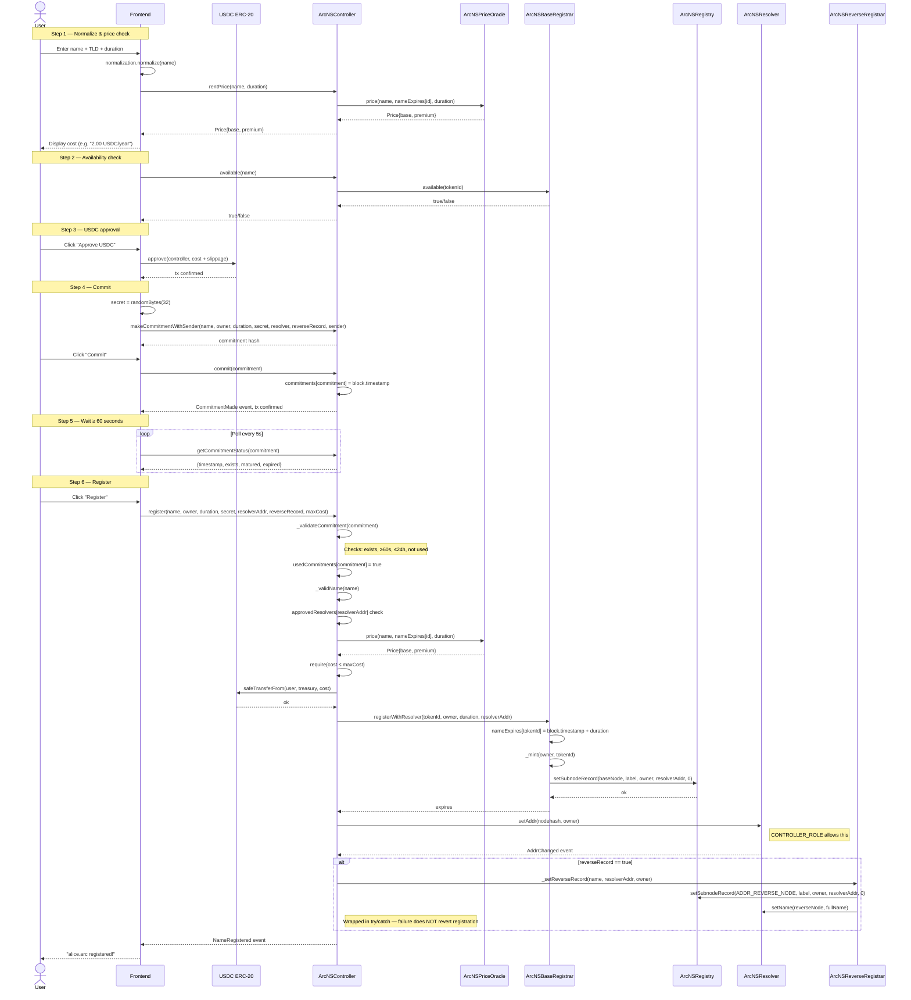
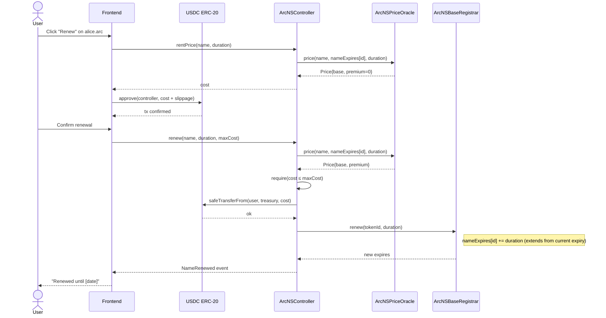
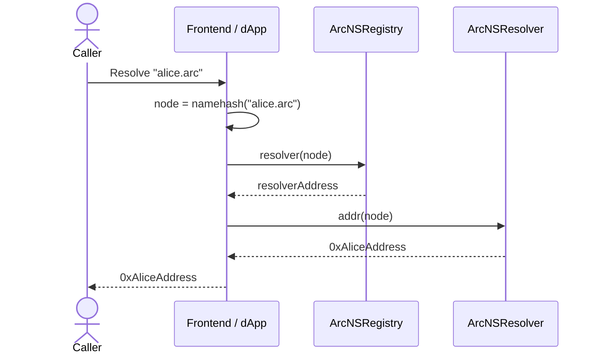
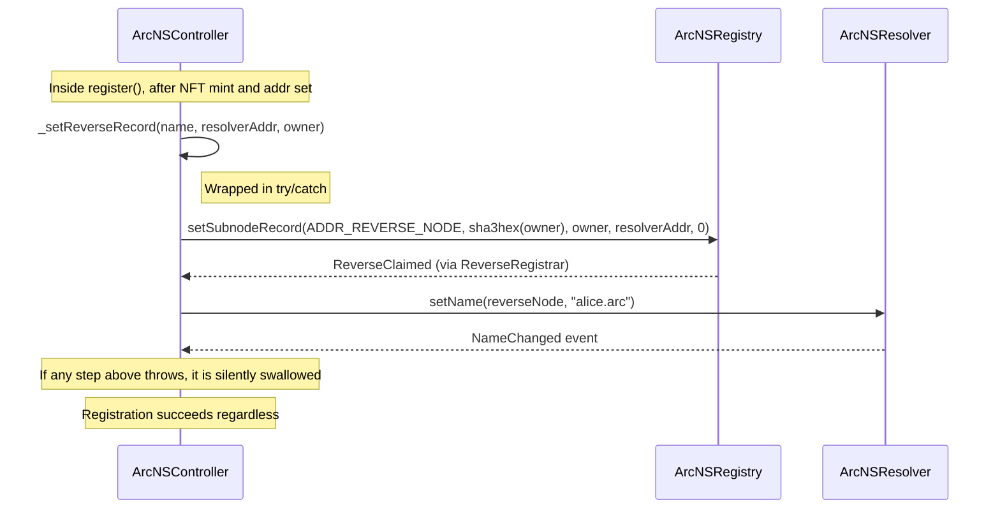
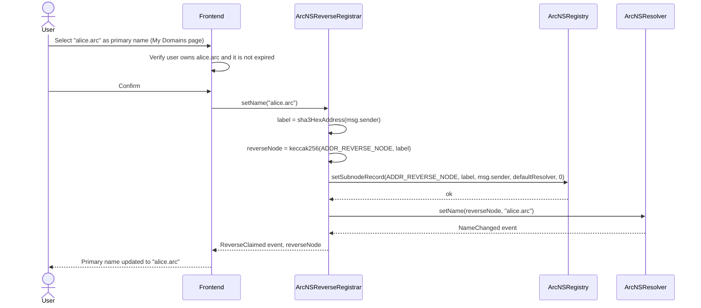
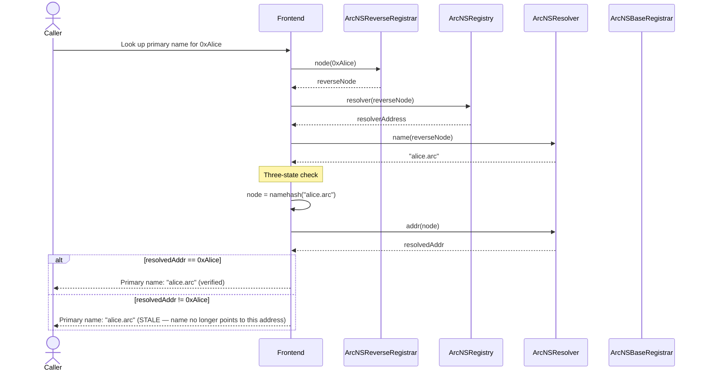
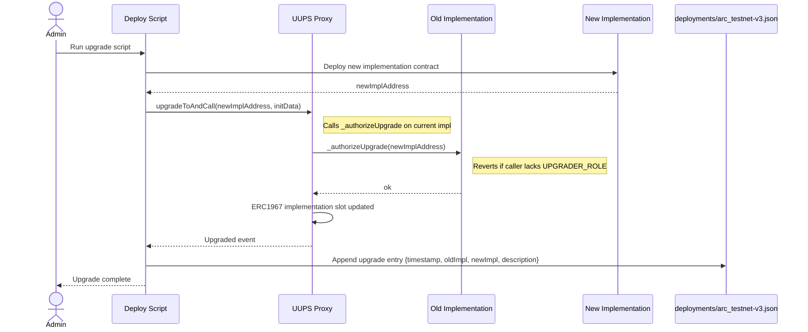

# ArcNS v3 — Contract Interaction Map

Detailed sequence diagrams for all primary on-chain flows.

---

## 1. Registration Flow

Full commit-reveal registration with addr set and optional reverse record.

---

## 2. Renewal Flow

---

## 3. Forward Resolution Flow

---

## 4a. Reverse Resolution — Registration-Time (reverseRecord = true)

---

## 4b. Reverse Resolution — Dashboard-Driven (setName)

---

## 4c. Reverse Lookup — Reading Primary Name

---

## 5. UUPS Upgrade Flow (Controller or Resolver)

