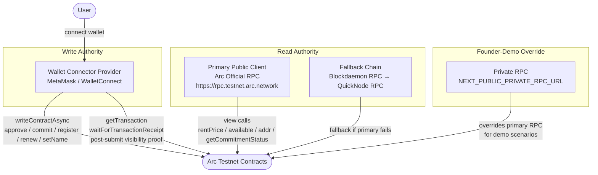
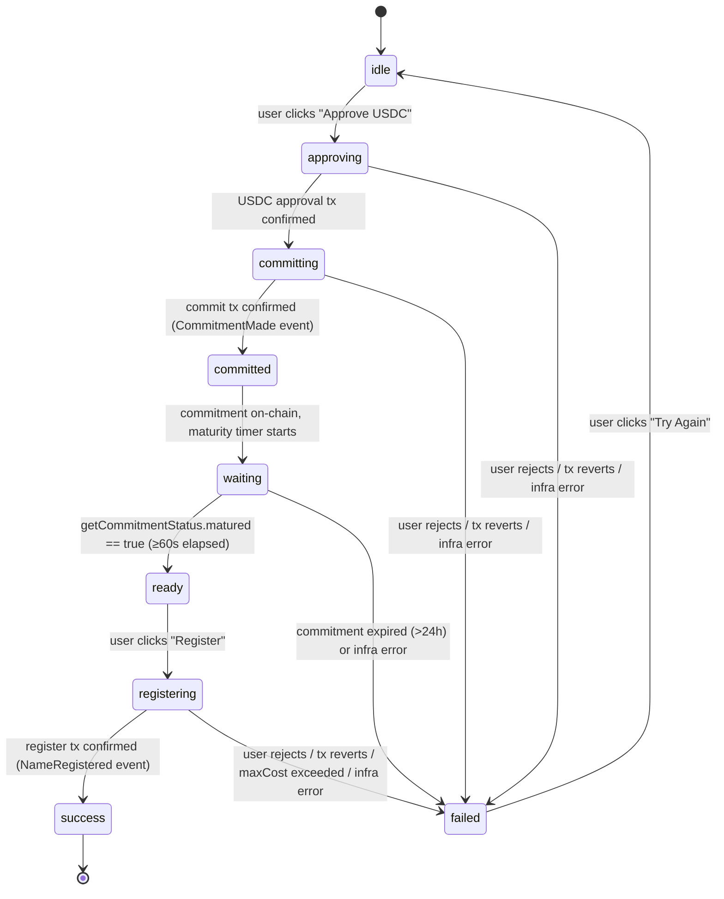
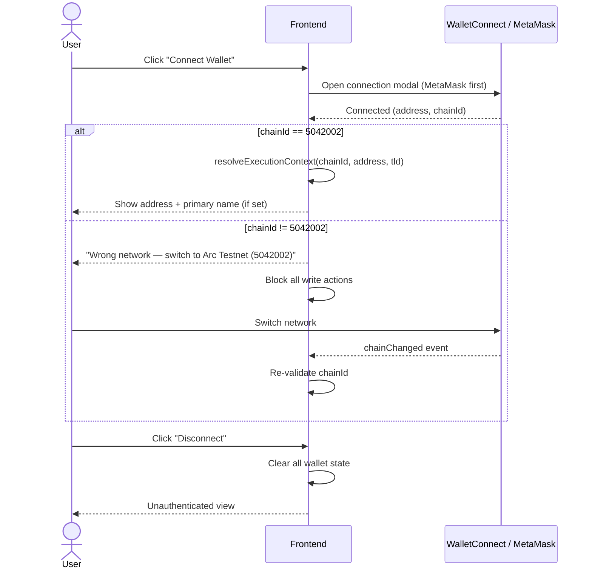

# ArcNS v3 — Frontend Runtime Model

---

## Stack

- **Framework**: Next.js 14 App Router
- **Wallet**: wagmi v2 + viem, WalletConnect v2, MetaMask-first
- **Chain**: Arc Testnet only (Chain ID 5042002, USDC native gas)
- **Chain enforcement**: hard-block all write transactions if `chainId ≠ 5042002`

---

## Provider Topology



**Rules**:
1. All write transactions (`approve`, `commit`, `register`, `renew`, `setName`) use the wallet
   connector provider exclusively. Never a detached public RPC.
2. Post-submission visibility proof (`getTransaction`) and receipt polling
   (`waitForTransactionReceipt`) use the sender-bound authority client (connector + publicActions).
3. View/read calls use the primary public client with fallback chain.
4. The `NEXT_PUBLIC_PRIVATE_RPC_URL` env var, when set, overrides the primary RPC URL for all
   public client reads. The wallet connector is unaffected.

---

## Registration Pipeline State Machine



### State Definitions

| State | Description |
|-------|-------------|
| `idle` | No active registration. User can enter a name. |
| `approving` | USDC `approve` tx submitted, waiting for confirmation. |
| `committing` | `commit` tx submitted, waiting for confirmation. |
| `committed` | Commitment confirmed on-chain. Maturity timer running. |
| `waiting` | Polling `getCommitmentStatus` until `matured == true`. |
| `ready` | Commitment matured. User can submit `register`. |
| `registering` | `register` tx submitted, waiting for confirmation. |
| `success` | Registration confirmed. NFT minted, addr set. |
| `failed` | Terminal error state. Error message displayed. |

### Internal Phase Granularity

Within each state, the pipeline tracks a finer-grained `phase` for progress display:

```
idle
validating-environment
awaiting-wallet-confirmation
commit-submitting
commit-submitted
commit-visible          ← tx visible on network (getTransaction proof)
commit-confirmed        ← receipt received
commitment-maturing     ← polling getCommitmentStatus
pre-register-proof      ← final on-chain checks before register
register-simulating     ← simulateContract(register)
register-submitting
register-confirmed
failed
```

---

## Error Classification Taxonomy

All errors are classified into one of three categories before being surfaced to the user.

### INFRA_FAILURE — Retry eligible

Caused by transient infrastructure issues. The pipeline retries up to 3 times with exponential
backoff (1s → 2s → 4s) before entering `failed`.

| Code | Trigger |
|------|---------|
| `TXPOOL_FULL` | Arc Testnet tx pool is full |
| `MEMPOOL_PROPAGATION_FAILURE` | Tx submitted but not visible after retry window |
| `RPC_SUBMISSION_FAILED` | HTTP 5xx / network error from RPC |
| `RPC_RESOURCE_NOT_AVAILABLE` | Arc provider "requested resource not available" |
| `RECEIPT_TIMEOUT` | `waitForTransactionReceipt` timed out |
| `TX_NOT_VISIBLE_AFTER_SUBMISSION` | `getTransaction` returns null after 20s |

### SEMANTIC_FAILURE — No retry, show message

Caused by on-chain state or user configuration. Retrying will not help.

| Code | Trigger |
|------|---------|
| `COMMITMENT_TOO_NEW` | `register` called before 60s elapsed |
| `COMMITMENT_EXPIRED_ONCHAIN` | Commitment older than 24h |
| `COMMITMENT_HASH_MISMATCH` | Computed commitment doesn't match on-chain |
| `REGISTER_SIMULATION_SEMANTIC_MISMATCH` | `simulateContract` reverts (name taken, resolver not approved, price exceeded) |
| `INSUFFICIENT_FUNDS` | Insufficient USDC balance |
| `CHAIN_MISMATCH` | Wallet on wrong network |
| `ABI_SIGNATURE_MISMATCH` | ABI doesn't match deployed contract |
| `REGISTER_PAYMENT_NOT_READY` | USDC allowance insufficient at register time |
| `REGISTER_REGISTRAR_STATE_MISMATCH` | Name no longer available at register time |

### USER_REJECTION — Cancel, no message

User explicitly rejected the transaction in their wallet. Return to pre-transaction state silently
(or with a brief "Cancelled" toast).

| Code | Trigger |
|------|---------|
| `WALLET_CONFIRMATION_TIMEOUT` | User did not confirm within 2 minutes |
| User rejected | `user rejected` in error message |

---

## Wallet Connection Flow



---

## Founder-Demo RPC Override

For high-reliability demo scenarios, a private RPC endpoint can be injected via environment variable.

**Configuration**:
```bash
# .env.local
NEXT_PUBLIC_PRIVATE_RPC_URL=https://private-rpc.arc.network/your-key
```

**Behavior when set**:
- `buildArcReadContext()` uses `NEXT_PUBLIC_PRIVATE_RPC_URL` as the primary RPC URL.
- The fallback chain still uses the public secondary RPCs.
- The wallet connector provider is unaffected (writes always go through the wallet).
- The override is transparent to the user — no UI indicator.

**Behavior when not set**:
- Falls back to `NEXT_PUBLIC_RPC_URL` env var, then to the hardcoded default
  `https://rpc.testnet.arc.network`.

---

## Key Hooks and Responsibilities

| Hook | Responsibility |
|------|---------------|
| `useRegistrationPipeline` | Orchestrates the full commit-reveal registration state machine. Single source of truth for registration state. |
| `useAvailability(name, tld)` | Calls `Controller.available(name)` and returns availability + price. |
| `useRentPrice(name, duration, tld)` | Calls `Controller.rentPrice(name, duration)` and formats USDC cost. |
| `useMyDomains(address)` | Queries Subgraph for all domains owned by address; falls back to contract reads. |
| `usePrimaryName(address)` | Reads reverse record: `ReverseRegistrar.node(addr)` → `Resolver.name(reverseNode)`. |
| `useSetPrimaryName` | Calls `ReverseRegistrar.setName(fullName)` and updates local state on success. |
| `useChainGuard` | Reads `useChainId()` and blocks write actions if `chainId ≠ 5042002`. |
| `useCommitmentStatus(commitment)` | Polls `Controller.getCommitmentStatus(commitment)` during the waiting phase. |

---

## Retry Policy Implementation

```
INFRA_FAILURE retry schedule:
  Attempt 1: immediate
  Attempt 2: wait 1000ms
  Attempt 3: wait 2000ms
  Attempt 4: wait 4000ms
  → After 4 attempts: enter failed state

SEMANTIC_FAILURE: no retry, immediate failed state

USER_REJECTION: no retry, return to idle/pre-transaction state
```

---

## Contract Address Resolution

Frontend contract addresses are derived exclusively from the generated config file:

```
scripts/generate-frontend-config.js
  reads: deployments/arc_testnet-v3.json
  writes: frontend/src/lib/generated-contracts.ts
```

`generated-contracts.ts` exports typed constants for all contract addresses. The frontend imports
from this file only — no hardcoded fallback addresses in production builds.

During development (before v3 deployment), the file falls back to v2 addresses for local testing.
