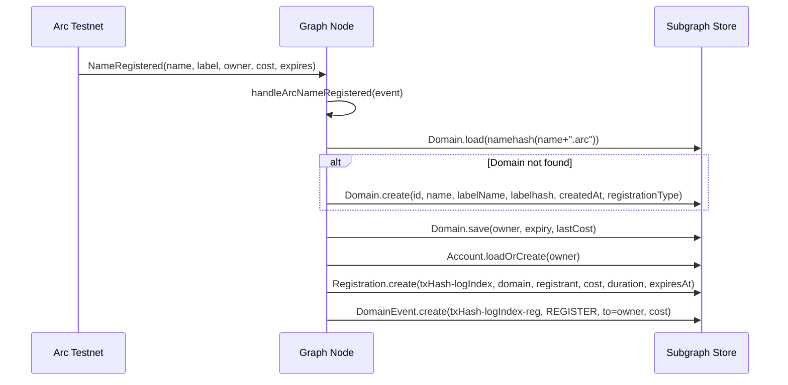
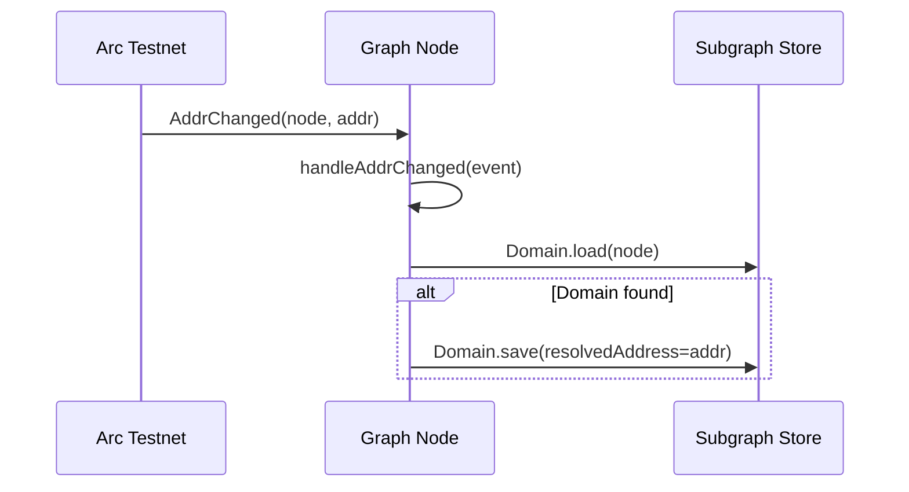

# ArcNS v3 — Subgraph Design

---

## v1 Scope Boundary

| Feature | v1 (this spec) | Deferred to v2 |
|---------|---------------|----------------|
| NameRegistered indexing | ✅ | — |
| NameRenewed indexing | ✅ | — |
| Registry Transfer / NewResolver | ✅ | — |
| AddrChanged (Resolver) | ✅ | — |
| ReverseClaimed (ReverseRegistrar) | ✅ | — |
| NameChanged (Resolver) | ❌ | v2 (with Resolver v2) |
| TextChanged (Resolver) | ❌ | v2 |
| ContenthashChanged (Resolver) | ❌ | v2 |
| Multicoin address records | ❌ | v2 |

---

## Entity Schema (GraphQL)

```graphql
enum RegistrationType {
  ARC
  CIRCLE
}

enum DomainEventType {
  REGISTER
  RENEW
  TRANSFER
}

# ── Domain ────────────────────────────────────────────────────────────────────

type Domain @entity(immutable: false) {
  id: ID!                        # namehash as hex string (0x...)
  name: String!                  # full name e.g. "alice.arc"
  labelName: String!             # normalized label e.g. "alice"
  labelhash: Bytes!              # keccak256(label)
  owner: Account!                # current owner (updated on Transfer)
  resolver: Bytes                # resolver contract address (updated on NewResolver)
  expiry: BigInt!                # Unix timestamp of expiry
  lastCost: BigInt               # USDC cost of most recent registration or renewal (6 decimals)
  resolvedAddress: Bytes         # latest addr(node) value from Resolver
  registrationType: RegistrationType!
  createdAt: BigInt!             # block.timestamp of first NameRegistered event
  registrations: [Registration!]! @derivedFrom(field: "domain")
  events: [DomainEvent!]!        @derivedFrom(field: "domain")
}

# ── Account ───────────────────────────────────────────────────────────────────

type Account @entity(immutable: false) {
  id: ID!                        # lowercase hex address (0x...)
  domains: [Domain!]!            @derivedFrom(field: "owner")
  reverseName: String            # primary name for this address (from ReverseRecord)
}

# ── Registration ──────────────────────────────────────────────────────────────

type Registration @entity(immutable: true) {
  id: ID!                        # txHash-logIndex
  domain: Domain!
  registrant: Bytes!             # address that called register()
  cost: BigInt!                  # USDC cost (6 decimals)
  duration: BigInt!              # registration duration in seconds
  expiresAt: BigInt!             # expiry timestamp
  blockNumber: BigInt!
  timestamp: BigInt!
  txHash: Bytes!
}

# ── DomainEvent ───────────────────────────────────────────────────────────────

type DomainEvent @entity(immutable: true) {
  id: ID!                        # txHash-logIndex-type
  domain: Domain!
  eventType: DomainEventType!
  from: Bytes                    # previous owner (TRANSFER) or zero address (REGISTER)
  to: Bytes                      # new owner (REGISTER / TRANSFER)
  cost: BigInt                   # USDC cost (REGISTER / RENEW only)
  blockNumber: BigInt!
  timestamp: BigInt!
  txHash: Bytes!
}

# ── ReverseRecord ─────────────────────────────────────────────────────────────

type ReverseRecord @entity(immutable: false) {
  id: ID!                        # lowercase hex address (0x...)
  name: String!                  # primary name e.g. "alice.arc"
  node: Bytes!                   # reverse node hash
  blockNumber: BigInt!
  timestamp: BigInt!
}
```

---

## Event Handler Mapping

### Controller: NameRegistered

**Event signature**: `NameRegistered(string name, bytes32 indexed label, address indexed owner, uint256 cost, uint256 expires)`

**Handler**: `handleArcNameRegistered` / `handleCircleNameRegistered`

**Entity updates**:
1. Compute `fullName = name + "." + tld`, `node = namehash(fullName)`.
2. Load or create `Domain(id=node)`:
   - On create: set `name`, `labelName`, `labelhash`, `createdAt`, `registrationType`.
   - Always update: `owner`, `expiry`, `lastCost`.
3. Load or create `Account(id=owner)`.
4. Create immutable `Registration(id=txHash-logIndex)`.
5. Create immutable `DomainEvent(id=txHash-logIndex-reg, eventType=REGISTER, to=owner, cost)`.

---

### Controller: NameRenewed

**Event signature**: `NameRenewed(string name, bytes32 indexed label, uint256 cost, uint256 expires)`

**Handler**: `handleArcNameRenewed` / `handleCircleNameRenewed`

**Entity updates**:
1. Compute `fullName`, `node`.
2. Load `Domain(id=node)` — must exist (guard: skip if not found).
3. Update: `expiry`, `lastCost`.
4. Create immutable `DomainEvent(id=txHash-logIndex-renew, eventType=RENEW, cost)`.

---

### Registry: Transfer

**Event signature**: `Transfer(bytes32 indexed node, address owner)`

**Handler**: `handleTransfer`

**Entity updates**:
1. Load `Domain(id=node)` — skip if not found (system nodes like TLD roots are not indexed).
2. Update `Domain.owner` to new owner.
3. Load or create `Account(id=newOwner)`.
4. Create immutable `DomainEvent(id=txHash-logIndex-transfer, eventType=TRANSFER, from=oldOwner, to=newOwner)`.

---

### Registry: NewResolver

**Event signature**: `NewResolver(bytes32 indexed node, address resolver)`

**Handler**: `handleNewResolver`

**Entity updates**:
1. Load `Domain(id=node)` — skip if not found.
2. Update `Domain.resolver`.

---

### Resolver: AddrChanged

**Event signature**: `AddrChanged(bytes32 indexed node, address a)`

**Handler**: `handleAddrChanged`

**Entity updates**:
1. Load `Domain(id=node)` — skip if not found.
2. Update `Domain.resolvedAddress`.

---

### ReverseRegistrar: ReverseClaimed

**Event signature**: `ReverseClaimed(address indexed addr, bytes32 indexed node)`

**Handler**: `handleReverseClaimed`

**Entity updates**:
1. Load or create `ReverseRecord(id=addr)`.
2. Update `node`.
3. Load or create `Account(id=addr)`.
4. Note: the `name` field on `ReverseRecord` is populated by the `NameChanged` handler (deferred to
   subgraph v2). In v1, `ReverseRecord.name` is set to empty string on creation and updated when
   the `NameChanged` event is indexed in v2.

**v1 limitation**: `ReverseClaimed` records the node claim but not the name string. The name string
requires indexing `NameChanged` from the Resolver, which is deferred to subgraph v2. The `Account.reverseName`
field will be populated in v2.

---

## Data Flow Diagrams

### Registration Data Flow



### Addr Resolution Data Flow



---

## Subgraph Manifest Structure

`indexer/subgraph.yaml`:

```yaml
specVersion: 0.0.5
schema:
  file: ./schema.graphql
dataSources:
  - kind: ethereum
    name: ArcController
    network: arc-testnet
    source:
      address: "<arcController proxy address from deployments/arc_testnet-v3.json>"
      abi: ArcNSController
      startBlock: <v3 deployment block>
    mapping:
      kind: ethereum/events
      apiVersion: 0.0.7
      language: wasm/assemblyscript
      entities: [Domain, Registration, Account, DomainEvent]
      abis:
        - name: ArcNSController
          file: ./abis/ArcNSController.json
      eventHandlers:
        - event: NameRegistered(string,indexed bytes32,indexed address,uint256,uint256)
          handler: handleArcNameRegistered
        - event: NameRenewed(string,indexed bytes32,uint256,uint256)
          handler: handleArcNameRenewed
      file: ./src/controller.ts

  - kind: ethereum
    name: CircleController
    network: arc-testnet
    source:
      address: "<circleController proxy address from deployments/arc_testnet-v3.json>"
      abi: ArcNSController
      startBlock: <v3 deployment block>
    mapping:
      kind: ethereum/events
      apiVersion: 0.0.7
      language: wasm/assemblyscript
      entities: [Domain, Registration, Account, DomainEvent]
      abis:
        - name: ArcNSController
          file: ./abis/ArcNSController.json
      eventHandlers:
        - event: NameRegistered(string,indexed bytes32,indexed address,uint256,uint256)
          handler: handleCircleNameRegistered
        - event: NameRenewed(string,indexed bytes32,uint256,uint256)
          handler: handleCircleNameRenewed
      file: ./src/controller.ts

  - kind: ethereum
    name: ArcNSRegistry
    network: arc-testnet
    source:
      address: "<registry address from deployments/arc_testnet-v3.json>"
      abi: ArcNSRegistry
      startBlock: <v3 deployment block>
    mapping:
      kind: ethereum/events
      apiVersion: 0.0.7
      language: wasm/assemblyscript
      entities: [Domain, DomainEvent, Account]
      abis:
        - name: ArcNSRegistry
          file: ./abis/ArcNSRegistry.json
      eventHandlers:
        - event: Transfer(indexed bytes32,address)
          handler: handleTransfer
        - event: NewResolver(indexed bytes32,address)
          handler: handleNewResolver
      file: ./src/registry.ts

  - kind: ethereum
    name: ArcNSResolver
    network: arc-testnet
    source:
      address: "<resolver proxy address from deployments/arc_testnet-v3.json>"
      abi: ArcNSResolver
      startBlock: <v3 deployment block>
    mapping:
      kind: ethereum/events
      apiVersion: 0.0.7
      language: wasm/assemblyscript
      entities: [Domain]
      abis:
        - name: ArcNSResolver
          file: ./abis/ArcNSResolver.json
      eventHandlers:
        - event: AddrChanged(indexed bytes32,address)
          handler: handleAddrChanged
        # NameChanged, TextChanged, ContenthashChanged — deferred to subgraph v2
      file: ./src/resolver.ts

  - kind: ethereum
    name: ArcNSReverseRegistrar
    network: arc-testnet
    source:
      address: "<reverseRegistrar address from deployments/arc_testnet-v3.json>"
      abi: ArcNSReverseRegistrar
      startBlock: <v3 deployment block>
    mapping:
      kind: ethereum/events
      apiVersion: 0.0.7
      language: wasm/assemblyscript
      entities: [ReverseRecord, Account]
      abis:
        - name: ArcNSReverseRegistrar
          file: ./abis/ArcNSReverseRegistrar.json
      eventHandlers:
        - event: ReverseClaimed(indexed address,indexed bytes32)
          handler: handleReverseClaimed
      file: ./src/reverseRegistrar.ts
```

**Note**: All contract addresses in the manifest are generated from `deployments/arc_testnet-v3.json`
via `scripts/generate-subgraph-config.js`. The manifest is not hand-edited.

---

## Source File Layout

```
indexer/
  schema.graphql          # entity definitions (this document)
  subgraph.yaml           # manifest (generated from deployment JSON)
  abis/
    ArcNSController.json
    ArcNSRegistry.json
    ArcNSResolver.json
    ArcNSReverseRegistrar.json
  src/
    controller.ts         # NameRegistered, NameRenewed handlers
    registry.ts           # Transfer, NewResolver handlers
    resolver.ts           # AddrChanged handler (v1 only)
    reverseRegistrar.ts   # ReverseClaimed handler
    utils.ts              # namehash, getOrCreateAccount helpers
  generated/              # auto-generated by graph codegen (gitignored)
  package.json
```
