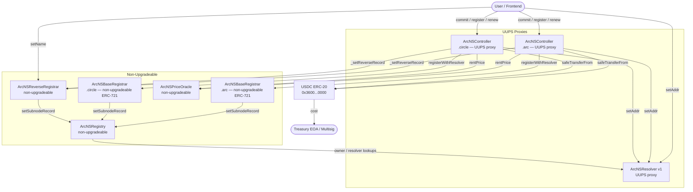

# ArcNS v3 — System Architecture

## Overview

ArcNS (Arc Name Service) is a decentralized naming system on Arc Testnet (Chain ID 5042002). It maps
human-readable names ending in `.arc` or `.circle` to EVM addresses. Names are owned as ERC-721 NFTs,
paid for in USDC (the native gas token), and subject to annual rent with a 90-day grace period.

The v3 on-chain system consists of **8 deployed contract instances** from **6 contract types**:
1 Registry, 2 BaseRegistrar (.arc + .circle), 2 Controller (.arc + .circle), 1 PriceOracle,
1 Resolver (shared), 1 ReverseRegistrar.

This document describes the canonical contract architecture for the v3 clean rebuild. All contracts
live under `contracts/v3/`. Existing v2 files are reference-only.

---

## Contract Interaction Map



---

## Contract Specifications

### ArcNSRegistry

**Responsibility**: Central ownership ledger. Maps `namehash → (owner, resolver, TTL)`. Root node
(`0x00…00`) owned by deployer at construction. TLD nodes assigned to their respective BaseRegistrars.

**Upgradeability**: Non-upgradeable. The ownership ledger is a security primitive — immutability
prevents any admin from silently reassigning name ownership. Bugs in the registry require a full
migration with user consent.

**Trust model / roles**:
- No roles. Authorization is purely node-based: only the current owner of a node (or an approved
  operator) may write to it.
- Root node owner (deployer) assigns TLD nodes to BaseRegistrars during deployment.

**Key interactions**:
- `setSubnodeRecord(node, label, owner, resolver, ttl)` — called by BaseRegistrar during registration.
- `setSubnodeOwner(node, label, owner)` — called by BaseRegistrar on `reclaim`.
- `owner(node)`, `resolver(node)` — read by Resolver's `authorised` modifier and by the frontend.

**Storage layout**:
```
mapping(bytes32 => Record) _records;   // namehash → {owner, resolver, ttl}
mapping(address => mapping(address => bool)) _operators;
```
No storage gaps needed (non-upgradeable).

**Events**: `Transfer(node, owner)`, `NewResolver(node, resolver)`, `NewOwner(node, label, owner)`,
`NewTTL(node, ttl)`, `ApprovalForAll(owner, operator, approved)`.

---

### ArcNSBaseRegistrar (×2: .arc, .circle)

**Responsibility**: Owns the TLD node in the Registry. Issues ERC-721 tokens for second-level domains.
Tracks expiry per token. Enforces 90-day grace period. Generates fully on-chain SVG tokenURI.

**Upgradeability**: Non-upgradeable. ERC-721 token contract stability is a user expectation — the
token contract address must never change. Bugs require a migration with explicit user opt-in.

**Trust model / roles**:
- `owner` (Ownable): deployer. Can add/remove controllers.
- `controllers` mapping: only approved Controller contracts may call `register*` and `renew`.
- `live` modifier: requires `registry.owner(baseNode) == address(this)`.

**Key interactions**:
- `registerWithResolver(id, owner, duration, resolver)` → calls `registry.setSubnodeRecord`.
- `renew(id, duration)` → extends `nameExpires[id]`.
- `reclaim(id, owner)` → calls `registry.setSubnodeOwner`.

**Storage layout**:
```
IArcNSRegistry public immutable registry;
bytes32        public immutable baseNode;
string         public tld;
uint256 public constant GRACE_PERIOD = 90 days;
mapping(uint256 => uint256) public nameExpires;   // tokenId → expiry timestamp
mapping(address => bool)    public controllers;
```

**NFT metadata** (ArcNS-branded, no ENS text):
- `name`: full domain name e.g. `alice.arc`
- `description`: `"ArcNS domain name. Decentralized identity on Arc Testnet."`
- `image`: inline SVG base64 data URI with ArcNS branding
- `attributes`: Domain, TLD, Expiry (date), Status (Active/Expired)

**Events**: `NameRegistered(id, owner, expires)`, `NameRenewed(id, expires)`,
`ControllerAdded(controller)`, `ControllerRemoved(controller)`.

---

### ArcNSController (×2: .arc, .circle)

**Responsibility**: Accepts USDC payments and orchestrates the commit-reveal registration and renewal
flow. Validates names, enforces pricing, transfers USDC to treasury, calls BaseRegistrar, sets addr
record on Resolver, optionally sets reverse record.

**Upgradeability**: UUPS proxy. Registration logic may require post-audit fixes without redeployment.
`_authorizeUpgrade` gated by `UPGRADER_ROLE`.

**Trust model / roles** (OpenZeppelin AccessControl):
- `ADMIN_ROLE`: set treasury, approve resolvers, general admin.
- `PAUSER_ROLE`: pause/unpause `register` and `renew`.
- `ORACLE_ROLE`: update the PriceOracle reference.
- `UPGRADER_ROLE`: authorize UUPS upgrades.

**Key interactions**:
- `commit(commitment)` → stores `commitments[commitment] = block.timestamp`.
- `register(name, owner, duration, secret, resolverAddr, reverseRecord, maxCost)` → validates
  commitment, checks name, checks maxCost, `safeTransferFrom` USDC, calls `base.registerWithResolver`,
  calls `resolver.setAddr`, optionally calls `reverseRegistrar._setReverseRecord`.
- `renew(name, duration, maxCost)` → checks maxCost, `safeTransferFrom` USDC, calls `base.renew`.
- `rentPrice(name, duration)` → calls `priceOracle.price(name, nameExpires, duration)`.
- `available(name)` → calls `base.available(tokenId)`.
- `getCommitmentStatus(commitment)` → returns `(timestamp, exists, matured, expired)`.

**Commit-reveal parameters**:
- `MIN_COMMITMENT_AGE` = 60 seconds
- `MAX_COMMITMENT_AGE` = 24 hours
- Commitments permanently invalidated after use (`usedCommitments` mapping).

**Commitment hash** (binds to sender for front-run protection):
```
keccak256(abi.encode(label, owner, duration, secret, resolverAddr, reverseRecord, msg.sender))
```

**Storage layout** (with gap for future fields):
```
uint256 private _reentrancyStatus;          // slot 0 — storage-based reentrancy guard
// AccessControl inherited slots
// Pausable inherited slots
ArcNSBaseRegistrar  public base;            // slot N
IArcNSPriceOracle   public priceOracle;
IERC20              public usdc;
IArcNSRegistry      public registry;
ArcNSResolver       public resolver;
IArcNSReverseRegistrar public reverseRegistrar;
address             public treasury;
mapping(bytes32 => uint256) public commitments;
mapping(bytes32 => bool)    public usedCommitments;
mapping(address => bool)    public approvedResolvers;
uint256[50] private __gap;                  // reserved for future fields
```

**Events**: `NameRegistered(name, label, owner, cost, expires)`, `NameRenewed(name, label, cost, expires)`,
`CommitmentMade(commitment)`, `TreasuryUpdated(old, new)`, `ResolverApproved(resolver, approved)`,
`NewPriceOracle(oracle)`.

---

### ArcNSPriceOracle

**Responsibility**: Returns USDC cost for a given name and duration. Implements length-based annual
pricing tiers and linear premium decay for recently expired names.

**Upgradeability**: Non-upgradeable. Price changes are made via `setPrices()` by the owner. No upgrade
path needed — the pricing formula is simple and the owner can update values without a new deployment.

**Trust model / roles**:
- `owner` (Ownable): can call `setPrices(p1, p2, p3, p4, p5)`.

**Pricing tiers** (canonical round-number values, USDC 6 decimals):
| Length | Annual price | Raw value |
|--------|-------------|-----------|
| 1 char | 50 USDC | 50_000_000 |
| 2 chars | 25 USDC | 25_000_000 |
| 3 chars | 15 USDC | 15_000_000 |
| 4 chars | 10 USDC | 10_000_000 |
| 5+ chars | 2 USDC | 2_000_000 |

**Price formula**:
- `base = annualPrice * duration / 365 days`
- **Premium decay (v1 canonical economic rule — in scope)**: When a name has recently expired, a linear premium is added to discourage immediate re-registration squatting. `premium = 100_000_000 * (28 days - elapsed) / 28 days` for the 28 days following expiry; 0 for non-expired names; 0 for names that have never been registered.
- Returns `Price { base, premium }`. Total cost = `base + premium`.

**Length counting**: Unicode codepoint count of the normalized label (not byte length).

**Events**: `PricesUpdated(p1, p2, p3, p4, p5)`.

---

### ArcNSResolver (v1)

**Responsibility**: Stores and returns EVM address records (`addr`, coin type 60) for namehashes.
v1 exposes exactly **one active write** (`setAddr`) and **one active read** (`addr`). Nothing else
is callable by external parties in v1. Future record types (text, contenthash, multicoin, name) are
planned for upgrade-safe evolution but are not part of the v1 active interface.

**Upgradeability**: UUPS proxy. The resolver feature set will expand in future versions without
redeployment. `_authorizeUpgrade` gated by `UPGRADER_ROLE`.

**Trust model / roles** (OpenZeppelin AccessControl):
- `ADMIN_ROLE`: general admin, grant/revoke CONTROLLER_ROLE.
- `CONTROLLER_ROLE`: allows Controller to call `setAddr` at registration time without being the node owner.
- `UPGRADER_ROLE`: authorize UUPS upgrades.

**Authorization for `setAddr`**: node owner OR approved operator in Registry OR holder of `CONTROLLER_ROLE`.

**v1 active interface** (the only externally callable functions in v1):
- `setAddr(bytes32 node, address a)` — write. Called by Controller (CONTROLLER_ROLE) at registration time, or by the node owner directly.
- `addr(bytes32 node) returns (address)` — read. Called by frontend and subgraph.

**v1 internal-only** (used by ReverseRegistrar via CONTROLLER_ROLE, not exposed as a general v1 interface):
- `setName(bytes32 node, string name)` — write. Called only by ReverseRegistrar to store reverse name records. Not advertised as a general v1 feature; exists solely to support the reverse resolution flow.

**Not exposed in v1** (storage slots allocated, no public functions):
- text records (`_texts` slot) — no `setText` / `text` functions in v1
- contenthash (`_contenthashes` slot) — no `setContenthash` / `contenthash` functions in v1
- multicoin addresses (`_addresses` for coin types other than 60) — no multicoin setters/getters in v1

**Storage layout** (designed for future expansion without collision):
```
// Slot 0–N: Initializable, AccessControl, UUPSUpgradeable inherited
IArcNSRegistry public registry;                              // slot A
mapping(bytes32 => mapping(uint256 => bytes)) private _addresses;  // slot A+1 — coin type 60 active in v1; other coin types reserved
mapping(bytes32 => mapping(string => string))  private _texts;     // slot A+2 — RESERVED, no public functions in v1
mapping(bytes32 => bytes)                      private _contenthashes; // slot A+3 — RESERVED, no public functions in v1
mapping(bytes32 => string)                     private _names;     // slot A+4 — internal only in v1 (reverse records via ReverseRegistrar)
uint256[50] private __gap;                                   // reserved for future record types
```

**Events emitted in v1**: `AddrChanged(node, addr)` only. `NameChanged` is emitted internally when ReverseRegistrar sets a reverse record but is not part of the advertised v1 event surface.

---

### ArcNSReverseRegistrar

**Responsibility**: Manages the `addr.reverse` TLD. Maps addresses to primary names. Provides
`setName(name)` for dashboard-driven primary name updates and is called internally by the Controller
for registration-time reverse records.

**Upgradeability**: Non-upgradeable. Reverse node ownership must be stable. Bugs require a new
deployment and user migration.

**Trust model / roles**:
- `owner` (Ownable): can update `defaultResolver`.
- No other privileged roles. Any address can claim its own reverse node.

**Key interactions**:
- `setName(name)` → claims reverse node for `msg.sender`, sets name record on `defaultResolver`.
- `node(addr)` → computes `keccak256(ADDR_REVERSE_NODE, sha3HexAddress(addr))`.
- `claimForAddr(addr, owner, resolver)` → allows contracts to claim their own reverse node.

**Constants**:
- `ADDR_REVERSE_NODE = namehash("addr.reverse") = 0x91d1777781884d03a6757a803996e38de2a42967fb37eeaca72729271025a9e2`

**Events**: `ReverseClaimed(addr, node)`, `DefaultResolverChanged(resolver)`.

---

## Trust Hierarchy Summary

```
Deployer (EOA)
  ├── owns Registry root node → assigns TLD nodes to BaseRegistrars
  ├── owns BaseRegistrar (Ownable) → adds Controller as controller
  ├── holds ADMIN_ROLE on Controller → sets treasury, approves resolvers
  ├── holds UPGRADER_ROLE on Controller → can upgrade Controller impl
  ├── holds ADMIN_ROLE on Resolver → grants CONTROLLER_ROLE to Controller
  ├── holds UPGRADER_ROLE on Resolver → can upgrade Resolver impl
  └── owns PriceOracle (Ownable) → can update prices

Controller (UUPS proxy)
  ├── is controller on BaseRegistrar → can register/renew names
  └── holds CONTROLLER_ROLE on Resolver → can setAddr at registration time

ReverseRegistrar
  └── owns addr.reverse node in Registry → can assign reverse subnodes
```
